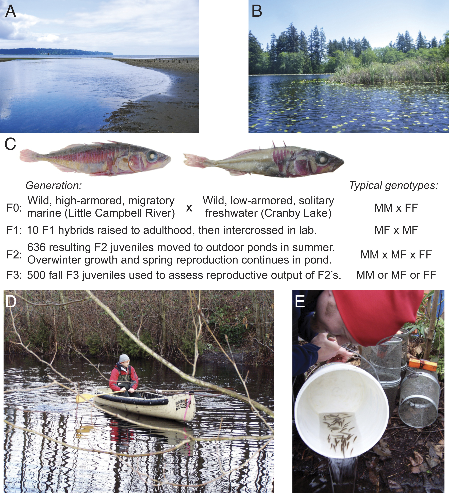
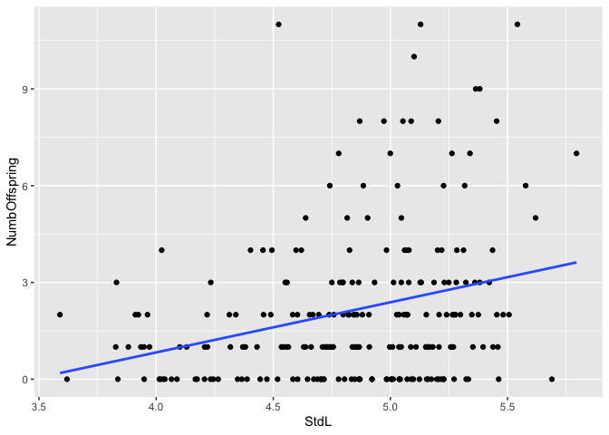
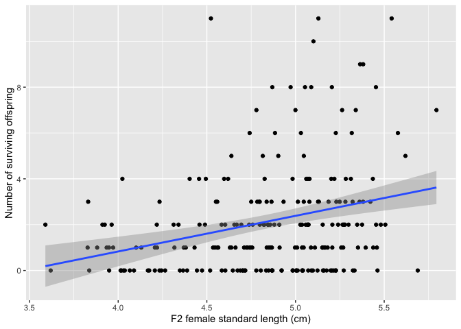
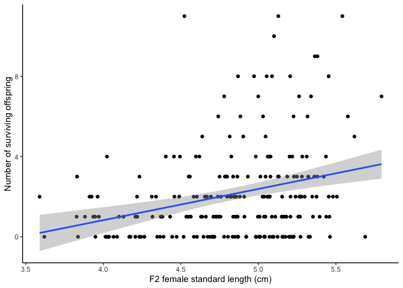
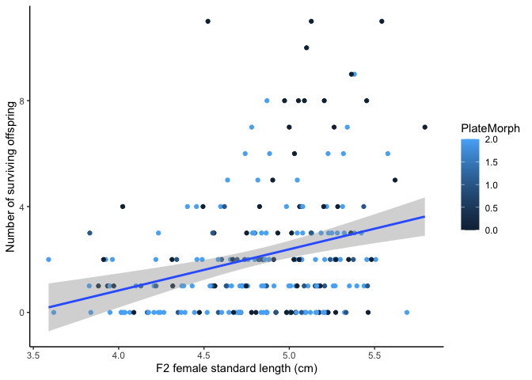
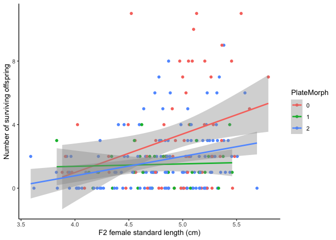
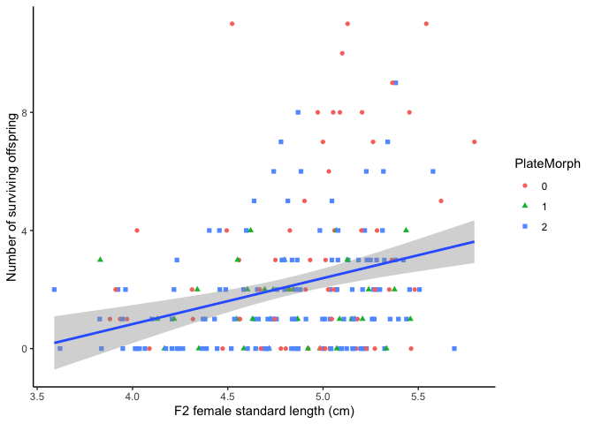
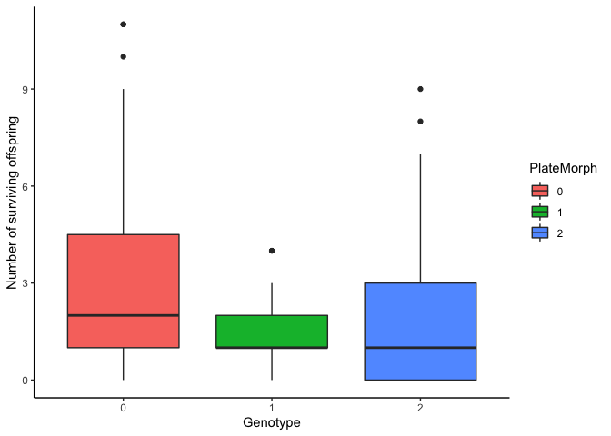
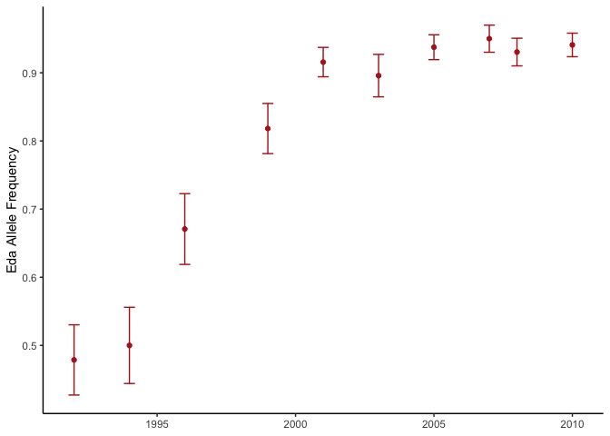

Practical R Knowledge and An Introduction to R Notebooks
================

## *Ryan Greenway*

*VTK 2022, Molecular Biology and Evolution* This guide was inspired by and in sections draws heavily from Michi Tobler's **[Evolution course](https://www.k-state.edu/biology/p2e/r-exercises.html)**

------------------------------------------------------------------------

# 1. Getting Started

------------------------------------------------------------------------

## 1.0. The Basics

The below image shows the basic layout of an R Studio session.


You can type your code directly into the Console and run it by pressing enter, or you can write longer, editable versions of code by creating R scripts (and other file types) and loading them into the Source/Editor window.

At it's most basic, R can be used to execute very simple calculations, *e.g.*

``` r
2+2
```

    ## [1] 4

Try typing this directly into the console then pressing *Enter*, as well as opening a new R script and running it from there by click the *Run* arrow indicator in the top right corner of the Editor.

The primary use of R is to write and use functions to complete specific tasks within R scripts.

Functions are operations that do a specific task in the same way every time. You can use functions that are included in Base R, e.g. sqrt()

``` r
sqrt(4) 
```

    ## [1] 2

You must always include the parentheses of a function, or it will not work properly. Running the name of the function without parentheses provides information about the function

``` r
sqrt 
```

    ## function (x)  .Primitive("sqrt")

Though we don't really cover it in detail today, you can write your own functions to do simple or complicated tasks. In section 1.1 you can see a small function I use to automatically set the location for R to look for input files and write output files.

If you don't know or can't remember what a function does, you can ask R, and a help window will open in the bottom right Studio pane.

``` r
?sqrt()
```

In your code you will often need to assign values, vectors, or tables to a specific variable. This can be done using either `=`or `<-`.

``` r
a <- 10  # assign 10 to 'a'
a
```

    ## [1] 10

``` r
b = 12  # same as above
b
```

    ## [1] 12

------------------------------------------------------------------------

## 1.1. Setting Your Working Directory

Having a well-organized file structure is critical to avoid issues with coding, because you will frequently read in data files, and you need to make sure that R knows where to look for those files. To facilitate this process, I have provided you with all the necessary files in a zipped folder. I recommend that you move that \*.zip file to the location where you want it before unzipping. The folder with your files is called a "Working Directory", you can simply use the `setwd()` command to point R toward the location of your files.

For Windows, the command might look like :

``` r
setwd("c:/Documents/my/working/directory")
```

For Mac:

``` r
setwd("/path/to/my/directory")
```

------------------------------------------------------------------------

## 1.2. Loading Your Libraries

When you install R, your computer can understand and execute a number of commands. This is what is known as "Base R". The power of R, however, is that you can expand the number of commands your computer understands by downloading and loading additional R packages (also called libraries). There are R packages specialized for pretty much any area of biology, providing the capability to analyze data from the level of genes and genomes to ecosystem level processes. To download and install new R packages, go to "Tools &gt; Install Packages..." and type in the name of the package you want to install. Alternatively, you can execute the following code:

``` r
#Install rstudioapi
install.packages("rstudioapi")
```

Note that you only need to install every package once (unless you reinstall R). I recommend deleting the code chunk above after you run it successfully, or you can silence it by a hash tag in the beginning of `install.packages("ggplot2")`. Failure to do so can cause problems during the export of your R Notebook as an \*.html file.

To make use of installed packages, you also need to load the packages *every time* you use R (*i.e.*, every time you restart the program). You can do this with the `library()` command, and you will find a code snippet prompting you to load all needed libraries at the beginning of each R Notebook (in a section that is typically called dependencies). You can try it here by executing the code chunk below to load `ggplot2`:

``` r
#Note that loading a library does not lead to an output
library(rstudioapi)
```

    ## Warning: package 'rstudioapi' was built under R version 3.6.2

Now that we have this library loaded, we can use a function I found to automatically set the working directory to the location where you have your R script saved.I copy and paste this into the beginning of all of my new scripts so that I no longer have to manually add the working directory each time, and so that I can send an single folder of files and scripts to a colleague and they will be able to automatically run it without having to find and change the directory on their computer.

``` r
set_wd <- function() {
  library(rstudioapi) # I keep this in my function in case I forget to load the 
  #necessary library earlier in a new script
  current_path <- getActiveDocumentContext()$path 
  setwd(dirname(current_path ))
  print( getwd() )
}
set_wd()
```

------------------------------------------------------------------------

## 1.3. Importing Data

One of the reasons we're working through the coding basics here is of course that you will work with actual data. In order to do that, you will need to import data into R. The easiest formats to work with for R will be \*.csv files (which stands for comma-separated values) or \*.txt files (often tab or space delimited values). You can use Excel or a text editor to create files in either of these formats. To import today's data, we will use the `read.csv()` function. Using the code below, you can import a test data set ("test\_data.csv"), where each row includes information about an individual stickleback fish from an experimental population (today's data will all come from **[this paper](https://doi.org/10.1073/pnas.1914889118)** (Schluter et al 2021, the design of the experiment is summarized in Figure 1 from the paper below).



``` r
#The line of code simply prompts the computer to read the "test_data.csv" file 
#and generate a data.frame called test.data
test.data <- read.csv("F2.pheno.csv")
head(test.data)
```

    ##       ID NumbOffspring     StdL PlateMorph Day
    ## 1 F2.011             1 4.207177          2 4.5
    ## 2 F2.013             3 3.830824          1 4.5
    ## 3 F2.014             0 4.244017          2 4.5
    ## 4 F2.015             0 4.065684          2 4.5
    ## 5 F2.016             0 4.088991          0 4.5
    ## 6 F2.017             0 4.348041          1 4.5

If this worked correctly, you should now see this data set as `test.data` in your global environment (top right panel). You can click it to view it. There should be 5 columns: ID, NumbOffspring, StdL, PlateMorph, Day.

This object represents a data frame (`data.frame`), a table that contains different types of data (numeric, logical, character, factor). A table with only numeric data would be stored as a matrix. Some functions, such as `read.csv()`, automatically import files as data.frames.

``` r
is.table(test.data)
```

    ## [1] FALSE

``` r
is.data.frame(test.data)
```

    ## [1] TRUE

If we had a tab separated input file instead, we could use the `read.delim` function. Learn more about it:

``` r
?read.delim
```

------------------------------------------------------------------------

## 1.4. Subsetting Data

Often, your full imported data set will have more information or variables than your are interested in including in a particular analysis. To streamline your workflow, extract specific information, or exclude certain things, you will need to subset the data.

To keep, or select certain elements from the data frame Here’s the basic way to retrieve that data in R:

``` r
#code code code
data1 <- test.data[c(1:10),c(1,3:4)]
data1
```

    ##        ID     StdL PlateMorph
    ## 1  F2.011 4.207177          2
    ## 2  F2.013 3.830824          1
    ## 3  F2.014 4.244017          2
    ## 4  F2.015 4.065684          2
    ## 5  F2.016 4.088991          0
    ## 6  F2.017 4.348041          1
    ## 7  F2.024 5.257507          2
    ## 8  F2.025 3.963255          2
    ## 9  F2.027 4.702363          2
    ## 10 F2.029 5.375203          1

To create the new data frame `data1`, we subsetted the our orignal data frame by extracting rows 1-10, and columns 1, 3, and 4.

We can also use this same approach to exclude specific rows or columns

``` r
data2 <- test.data[-c(11:224),-c(2,5)]
data2
```

    ##        ID     StdL PlateMorph
    ## 1  F2.011 4.207177          2
    ## 2  F2.013 3.830824          1
    ## 3  F2.014 4.244017          2
    ## 4  F2.015 4.065684          2
    ## 5  F2.016 4.088991          0
    ## 6  F2.017 4.348041          1
    ## 7  F2.024 5.257507          2
    ## 8  F2.025 3.963255          2
    ## 9  F2.027 4.702363          2
    ## 10 F2.029 5.375203          1

Here, instead of subsetting the rows and columns we wanted returned, we subsetted the rows and columns we did not want returned and then omitted them with the “-” sign. By calling both of the new data frames, we can see that both return the same subset of the original education data frame by including or excluding certain features.

While this method is nice when you have relatively small data sets or know the specific rows/columns you wish to subset, it doesn't scale up to larger or more complex data sets very well. Instead, we can subset based on values. Below, we are extracting the rows we need by using the `which()` function. This function returns the indices where the PlateMorph column of the data frame is 2. We retrieve the columns of the subset by using the `%in%` operator on the column names.

``` r
data3 <- test.data[which(test.data$PlateMorph == 2),names(test.data) %in% 
                     c("ID","StdL","PlateMorph")]
head(data3)
```

    ##       ID     StdL PlateMorph
    ## 1 F2.011 4.207177          2
    ## 3 F2.014 4.244017          2
    ## 4 F2.015 4.065684          2
    ## 7 F2.024 5.257507          2
    ## 8 F2.025 3.963255          2
    ## 9 F2.027 4.702363          2

We can do the same thing with a bit simpler code using the `subset()` function.

``` r
data4 <- subset(test.data, PlateMorph == 1, 
                select = c("ID","StdL","PlateMorph"))
head(data4)
```

    ##        ID     StdL PlateMorph
    ## 2  F2.013 3.830824          1
    ## 6  F2.017 4.348041          1
    ## 10 F2.029 5.375203          1
    ## 13 F2.036 4.984142          1
    ## 16 F2.052 4.843777          1
    ## 17 F2.053 4.722945          1

------------------------------------------------------------------------

# 2. Making Figures

An important skill for scientists is the ability to visualize data in different ways to facilitate data interpretation. In the following sections, I will explain step by step (that is code line by code line) how to make a simple graph with the stickleback data set. Let's aim to make a scatter plot showing the relationship between an individual's body length and the number of offspring it produced (*i.e.* it's fitness) in this stickleback population. The process is not much different than sketching a graph by hand and layering different parts of the graph on top of each other, just that you use words (code) to make the computer draw.

I like to use a package called `ggplot2`, which allows for highly customizable plotting, to make most all of my figures for publications. **You will probably need to install and load this library if this is the first time using R on your computer.**

------------------------------------------------------------------------

## 2.1. Define the Axes and Coordinate System

The first step of making any graph is to define the axes and establish the coordinate grid that allows for the plotting of the data. You can do this by calling the `ggplot()` function within which you first need to specify the data source (in our case the data frame called `test.data`) and then the so called aesthetics---`aes()`---that contain information about what variables define the x and y axes. In practice, this is accomplished with the following line of code:

``` r
#This line of code calls for the ggplot function (a plotting function) and 
#make a grid based on the test.data data frame, using length as the x axis 
#and mass as the y axis
library(ggplot2)
```

    ## Warning: package 'ggplot2' was built under R version 3.6.2

    ## Warning: replacing previous import 'lifecycle::last_warnings' by
    ## 'rlang::last_warnings' when loading 'tibble'

    ## Warning: replacing previous import 'lifecycle::last_warnings' by
    ## 'rlang::last_warnings' when loading 'pillar'

``` r
ggplot(test.data, aes(x=StdL, y=NumbOffspring))
```


------------------------------------------------------------------------

## 2.2. Adding a Layer with Data Points

The second step is to draw the data into the established coordinate system. To do so, you just need to tell the program what kind of graph you want to draw. Different graph types in `ggplot2` are referred to as geoms, and a scatter plot is designated as `geom_point`. You can literally add that to your existing code with a plus sign. For an overview of some of the graph types (geoms) `ggplot2` offers, check the appendix of our textbook.

``` r
ggplot(test.data, aes(x=StdL, y=NumbOffspring)) +
  geom_point()
```


------------------------------------------------------------------------

## 2.3. Adding a Trendline

Whenever we look at the relationship between two variables, we may want to add a trendline. You can add a trendline by adding the `geom_smooth()` command to your existing code, and `method="lm"` designates that your trendline should be linear. The `se` argument designates whether or not you want to draw an error estimate around your trendline.

``` r
#The code within the brackets of the geom_smooth command specified some 
#additional options, namely that we want to draw a straight line (method="lm") 
#and that we do not want to show the confidence interval (se=FALSE). 
#Set the se=TRUE and see what happens.
ggplot(test.data, aes(x=StdL, y=NumbOffspring)) +
  geom_point() +
  geom_smooth(method="lm", se=FALSE)
```



------------------------------------------------------------------------

## 2.4. Changing the Axes Labels

The variable names in the data set do not always provide the clearest description of what a variable means. We can modify the x and y axis labels using the `xlab()` and `ylab()` functions, respectively. The actual titles need to be written within quotation marks:

``` r
#Simply add the new label text in quotation marks
ggplot(test.data, aes(x=StdL, y=NumbOffspring)) +
  geom_point() +
  geom_smooth(method="lm", se=TRUE) +
  xlab("F2 female standard length (cm)") +
  ylab("Number of surviving offspring")
```

    ## `geom_smooth()` using formula 'y ~ x'



------------------------------------------------------------------------

## 2.5. Change the Theme

The default theme of `ggplot` is pretty ugly to me. You can quickly alter the look of the graph by switching to a number of other possible themes. The `theme_classic()` is pretty standard for making publication quality figures, but you can customize the look of your graph with themes listed [here](https://www.datanovia.com/en/blog/ggplot-themes-gallery/#basic-ggplot).

``` r
ggplot(test.data, aes(x=StdL, y=NumbOffspring)) +
  geom_point() +
  geom_smooth(method="lm", se=TRUE) +
  xlab("F2 female standard length (cm)") +
  ylab("Number of surviving offspring") +
  theme_classic()
```

    ## `geom_smooth()` using formula 'y ~ x'



Now you've got a perfectly good graph! In fact, check out how your graph compares to the figure actually included in the paper in [Figure 5](https://www.pnas.org/doi/full/10.1073/pnas.1914889118#fig05). For making other graphs with your own data later in the course, or if you want to make your graph look even more similar to the paper's, check out the [ggplot2 cheatsheet](https://raw.githubusercontent.com/rstudio/cheatsheets/main/data-visualization.pdf).

For example, if we wanted to check out how an individuals genotype might be related to the relationship between size and fitness, we can change our graph to include genotype data with a small change in the code.

``` r
ggplot(test.data, aes(x=StdL, y=NumbOffspring, color=PlateMorph)) +
  geom_point() +
  geom_smooth(method="lm", se=TRUE) +
  xlab("F2 female standard length (cm)") +
  ylab("Number of surviving offspring") +
  theme_classic()
```

    ## `geom_smooth()` using formula 'y ~ x'



As you can see in this plot, ggplot does not recognize that our Plate Morph variable is actually categorical, since it is designated using numbers (0, 1, 2), and is trying to fit a continuous color scale to the points. We need to tell R to change the way this column is classified, from a number (integer) to a factor (category).

``` r
is.numeric(test.data$PlateMorph)
```

    ## [1] TRUE

``` r
test.data$PlateMorph <- as.factor(test.data$PlateMorph)
is.factor(test.data$PlateMorph)
```

    ## [1] TRUE

``` r
is.numeric(test.data$PlateMorph)
```

    ## [1] FALSE

Now we can try our plot again

``` r
ggplot(test.data, aes(x=StdL, y=NumbOffspring, color=PlateMorph)) +
  geom_point() +
  geom_smooth(method="lm", se=TRUE) +
  xlab("F2 female standard length (cm)") +
  ylab("Number of surviving offspring") +
  theme_classic()
```

    ## `geom_smooth()` using formula 'y ~ x'



As you can see, this might not be ideal. ggplot is now trying to fit a separate line to each of the genotype classes. To get around this, we can break up our ggplot aesthetics into the separate point and line layers.

``` r
ggplot(test.data) +
  geom_point(aes(x=StdL, y=NumbOffspring, color=PlateMorph, shape=PlateMorph)) +
  geom_smooth(aes(x=StdL, y=NumbOffspring), method="lm", se=TRUE) +
  xlab("F2 female standard length (cm)") +
  ylab("Number of surviving offspring") +
  theme_classic()
```

    ## `geom_smooth()` using formula 'y ~ x'



------------------------------------------------------------------------

# 3. Coding Simple Linear Models

R is probably most widely used as a tool for statistical analysis. We will briefly cover how to write and run a simple linear model (regression) using R.

R uses the function `lm` to fit linear models.

``` r
?lm
```

To look for the relationship between body size and fitness, we can fit a linear model using fitness as our response variable and body size as a predictor.

``` r
model <- lm(NumbOffspring ~ StdL, data = test.data)
```

In R model syntax, the response (dependent) variable is on the left side, with predictors (separated by +) following the ~

``` r
model
```

    ## 
    ## Call:
    ## lm(formula = NumbOffspring ~ StdL, data = test.data)
    ## 
    ## Coefficients:
    ## (Intercept)         StdL  
    ##      -5.393        1.556

`summary()` applied to an `lm` object will give p-values and other relevant information:

``` r
summary(model)
```

    ## 
    ## Call:
    ## lm(formula = NumbOffspring ~ StdL, data = test.data)
    ## 
    ## Residuals:
    ##     Min      1Q  Median      3Q     Max 
    ## -3.4571 -1.5928 -0.4995  0.8987  9.3571 
    ## 
    ## Coefficients:
    ##             Estimate Std. Error t value Pr(>|t|)    
    ## (Intercept)  -5.3933     1.6835  -3.204  0.00156 ** 
    ## StdL          1.5557     0.3469   4.485 1.17e-05 ***
    ## ---
    ## Signif. codes:  0 '***' 0.001 '**' 0.01 '*' 0.05 '.' 0.1 ' ' 1
    ## 
    ## Residual standard error: 2.301 on 221 degrees of freedom
    ## Multiple R-squared:  0.08343,    Adjusted R-squared:  0.07928 
    ## F-statistic: 20.12 on 1 and 221 DF,  p-value: 1.172e-05

This will output the results of the analysis in a table, with significance shown by the indicated characters (*e.g.* \*\*\*). We can see that F2 female body size predicts some of the variation in number of surviving F3 offspring, as seen by the significant relationship between body size and the number of offspring surviving, as reported in the original paper.

------------------------------------------------------------------------

# 4 Introduction to R Notebooks

Annotating your code is one of the best ways to help you keep track of what you are doing. As you might have noticed in some of the above code, I will often use hash tags (`#`) to make notes within code. Hash tags "silence" the text that follows on the same line, such that the computer jumps over that section when executing the code. That is useful for code annotation, and you will frequently see hash tags to add further descriptions or explanations within code you find in many coding languages.

Alternatively, you might want to provide more information, or a more detailed walk through of your thought process or interpretation of results. This is where R Markdown and R Notebooks shine. R Markdown/Notebook files (\*.Rmd) allow you to combine text elements with snippets of code and the codes output in a single document.

------------------------------------------------------------------------

## 4.0 The General Structure of an R Notebook

There are three main parts to an R Notebook file. In addition, each R Notebook automatically generates an \*.html file that presents you with the formatted output, which you can submit as a report or send to collaborators as a nice, easily readable document with all of your code and relevant outputs. In fact that's what we have been working with for the whole day so far. You can check out this file in the zipped folder to get a better idea about the coding in a Markdown format.

Opening an \*.Rmd file automatically sets the working directory to the directory of that R Notebook file. So after unzipping the folder for today's exercises, it is important not move any files out of the folder, unless you want to manually tell the computer where to look for readable files as we covered above.

------------------------------------------------------------------------

## 4.1. The Header

The header, which you can see at the beginning of an R markdown/notebook document, is delineated with three dashes (`---`) at the beginning and the end. It includes some code that is important for the formatting of output files, so I would recommend not altering that section unless you look into the details. If you would like to learn more about the different header options, you can find a good tutorial [here](https://bookdown.org/yihui/rmarkdown/html-document.html#table-of-contents).

------------------------------------------------------------------------

## 4.2. Code Chunks

Within notebooks, R code chunks are delineated with three ticks (`'''`) at the beginning and the end, and `{r}` after the first set of ticks lets your computer know that you will be using the R programming language. You can always add a code chunk by clicking "Insert &gt; R" above. Any text within a code chunk, if written correctly, represents executable R code, which the computer can interpret as you would an R script or in the console. You can make your computer execute the code in a chunks by pressing the small, green play arrow on the top right corner of each chunks, or you can just highlight the code and press command+enter (control+enter on PC). When you execute the code, the output will automatically appear below a chunk.

------------------------------------------------------------------------

## 4.3. Text

The text in between code snippets is just that: text. You can use these sections, as I have here, to provide background information and annotations. You can use a variety of prompts to format your text if you are working with basic Markdown (see [here](https://rstudio.com/wp-content/uploads/2015/02/rmarkdown-cheatsheet.pdf) for a cheat sheet). Most will probably prefer the text editor that is implemented in R Studio to format text with the click of a button.

------------------------------------------------------------------------

## 4.4. HTML Preview and Output

As already mentioned, your R Notebook (including text, code chunks, and the outputs from your code) can be automatically knitted into an \*.html file. You can click "Preview &gt; Preview Notebook" to see the live html version as you are working on your R Notebook (just make sure to save to update), and you can find the shareable \*.html file in the same folder as your \*.Rmd file.

------------------------------------------------------------------------

# 5 Making Your Own R Notebook and More R Practice

After that brief introduction to R Notebooks, let's try making out own. You can start a new R Notebook by selecting `File > New File > R Notebook` or by starting a blank text file and adding R Notebook header information (*e.g.* by copying and pasting the header of this Notebook).

------------------------------------------------------------------------

## 5.1 Creating Boxplots

Boxplots are another useful graph for showing a lot of information in a single figure (*i.e.* information about the distribution of the data). There are a lot of variations on boxplots that can be even more informative, such as [violin plots](http://www.sthda.com/english/wiki/ggplot2-violin-plot-quick-start-guide-r-software-and-data-visualization) and [raincloud plots](https://www.cedricscherer.com/2021/06/06/visualizing-distributions-with-raincloud-plots-and-how-to-create-them-with-ggplot2/). Consider trying one of these as well.

Insert a new code chunk, and load in the `F2.pheno.csv` we used above.

Subset your data to remove the `Day` column. We will now make a boxplot using ggplot2 (load the library!); simply replace `geom_point` and `geom_smooth` with `geom_boxplot`. Use the ggplot2 cheatsheet and/or Google to change the color of the boxplots



------------------------------------------------------------------------

## 5.2 Plotting Change in Allele Frequency Over Time

Insert another code chunk and read in the next data set, documenting change in allele frequency for the candidate gene underlying fitness variation in a natural population of stickleback. The data can be found in file called “LobergLake.csv”. The file includes several variables: `year`, number of fish caught with freshwater or marine alleles (`EDAFF`, `EDAFM`, `EDAMM`), the total number of Freshwater allels in the sample (`EDAFcount`) and the total number of alleles (`EDATotcount`) in any given year.

    ##    year EDAFF EDAFM EDAMM EDAFcount EDATotcount
    ## 1  1983    NA    NA    NA        NA          NA
    ## 2  1984    NA    NA    NA        NA          NA
    ## 3  1985    NA    NA    NA        NA          NA
    ## 4  1986    NA    NA    NA        NA          NA
    ## 5  1987    NA    NA    NA        NA          NA
    ## 6  1988    NA    NA    NA        NA          NA
    ## 7  1989    NA    NA    NA        NA          NA
    ## 8  1990    NA    NA    NA        NA          NA
    ## 9  1991    NA    NA    NA        NA          NA
    ## 10 1992     8    29    10        45          94
    ## 11 1993    NA    NA    NA        NA          NA
    ## 12 1994    14    12    14        40          80
    ## 13 1995    NA    NA    NA        NA          NA
    ## 14 1996    18    19     4        55          82
    ## 15 1997    NA    NA    NA        NA          NA
    ## 16 1998    NA    NA    NA        NA          NA
    ## 17 1999    35    20     0        90         110
    ## 18 2000    NA    NA    NA        NA          NA
    ## 19 2001    70    12     1       152         166
    ## 20 2002    NA    NA    NA        NA          NA
    ## 21 2003    40     6     2        86          96
    ## 22 2004    NA    NA    NA        NA          NA
    ## 23 2005    77    11     0       165         176
    ## 24 2006    NA    NA    NA        NA          NA
    ## 25 2007    54     6     0       114         120
    ## 26 2008    68    11     0       147         158
    ## 27 2009    NA    NA    NA        NA          NA
    ## 28 2010    82    11     0       175         186

There are a lot of years with no sampling data. Let's clean up our data frame by removing those rows with the `na.omit()` function

    ##    year EDAFF EDAFM EDAMM EDAFcount EDATotcount
    ## 10 1992     8    29    10        45          94
    ## 12 1994    14    12    14        40          80
    ## 14 1996    18    19     4        55          82
    ## 17 1999    35    20     0        90         110
    ## 19 2001    70    12     1       152         166
    ## 21 2003    40     6     2        86          96
    ## 23 2005    77    11     0       165         176
    ## 25 2007    54     6     0       114         120
    ## 26 2008    68    11     0       147         158
    ## 28 2010    82    11     0       175         186

------------------------------------------------------------------------

Calculate the frequency of the Freshwater (F) allele by dividing the number of F alleles observed by the total number of sampled alleles in a given year, then assign that value to a new variable (column) in your data frame.

    ##    year EDAFF EDAFM EDAMM EDAFcount EDATotcount frequency
    ## 10 1992     8    29    10        45          94 0.4787234
    ## 12 1994    14    12    14        40          80 0.5000000
    ## 14 1996    18    19     4        55          82 0.6707317
    ## 17 1999    35    20     0        90         110 0.8181818
    ## 19 2001    70    12     1       152         166 0.9156627
    ## 21 2003    40     6     2        86          96 0.8958333
    ## 23 2005    77    11     0       165         176 0.9375000
    ## 25 2007    54     6     0       114         120 0.9500000
    ## 26 2008    68    11     0       147         158 0.9303797
    ## 28 2010    82    11     0       175         186 0.9408602

Now calculate the standard error for the allele frequency using this equation `sqrt(frequency * (1 - frequency)/EDATotcount)` and assign it to another new column for each year in the data frame

    ##    year EDAFF EDAFM EDAMM EDAFcount EDATotcount frequency         se
    ## 10 1992     8    29    10        45          94 0.4787234 0.05152435
    ## 12 1994    14    12    14        40          80 0.5000000 0.05590170
    ## 14 1996    18    19     4        55          82 0.6707317 0.05189702
    ## 17 1999    35    20     0        90         110 0.8181818 0.03677454
    ## 19 2001    70    12     1       152         166 0.9156627 0.02156869
    ## 21 2003    40     6     2        86          96 0.8958333 0.03117758
    ## 23 2005    77    11     0       165         176 0.9375000 0.01824607
    ## 25 2007    54     6     0       114         120 0.9500000 0.01989556
    ## 26 2008    68    11     0       147         158 0.9303797 0.02024741
    ## 28 2010    82    11     0       175         186 0.9408602 0.01729601

------------------------------------------------------------------------

Let's plot our allele frequency data and the standard error (using [geom\_errorbar](http://www.sthda.com/english/wiki/ggplot2-error-bars-quick-start-guide-r-software-and-data-visualization)) for each year to see how the population has evolved at this locus as they adapted to freshwater.


